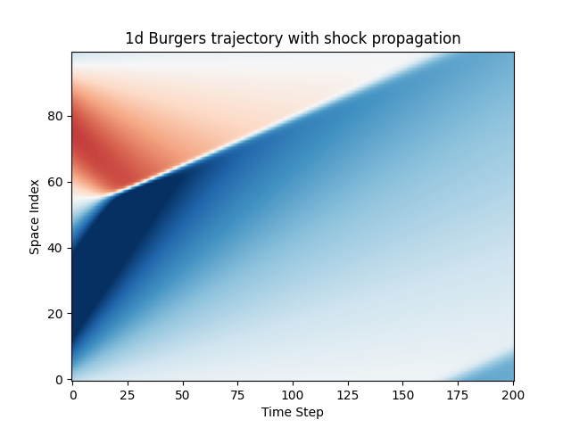

# Picardax

A framework for writing implicit timesteppers for nonlinear PDEs in JAX.

### Quickstart

```python
import jax
import jax.numpy as jnp
from implicax import *
import matplotlib.pyplot as plt

burgers_stepper = Burgers(L=1.0, N=100, dt=0.01, nu=1e-3)

mesh = jnp.linspace(0, burgers_stepper.L, burgers_stepper.N, endpoint=False)
u_0 = jnp.sin(2 * jnp.pi * mesh) + 0.3

trj = rollout(burgers_stepper, 200, include_init=True)(u_0)

plt.imshow(trj.T, aspect='auto', origin='lower', cmap='RdBu', vmin=-1, vmax=1)
plt.xlabel('Time Step')
plt.ylabel('Space Index')
plt.title('1d Burgers trajectory with shock propagation')
```



This examples instantiates an implicit first-order upwinding time stepper for
the 1d Burgers equation. This object is callable and advances the state vector
by $\Delta t=0.1$. The `rollout` function autoregressively applies it to produce
a trajectory which is visualized in a spatio-temporal plot.

### Features

- A general interface for time steppers based on (differentiable) Picard solvers
- An interface tailored to solving PDEs of the form $\frac{\partial u}{\partial
  t} + F(u) = 0$
- Support for a wide-range of adjoint modes that are registered within the JAX'
  automatic differentiation engine
- JIT-compilation, GPU-support, easy batching due to JAX
- States and trajectories are simply JAX arrays, no custom types
- A growing library of pre-implemented steppers for common PDEs with various
  boundary conditions
- All time steppers are [Callable
  PyTrees](https://docs.kidger.site/equinox/all-of-equinox/#1-models-as-pytrees)
  allowing us to vmap over multiple solvers for the same initial condition.
- By working with pure JAX arrays and being callable PyTrees, picardax
  timesteppers easily integrate with [Equinox deep
  learning](https://docs.kidger.site/equinox/) allowing us to easily build
  differentiable physics pipelines, integrating physics solvers with deep
  learning.

### Background

Implicit timesteppers require the solution of high-dimensional root-finding
problems to advance the state. Generally speaking, those are of the form

$$ g(u_h^{[t+1]}; u_h^{[t]}) = 0 $$

where $u_h^{[t]}$ is the given state at the current point in time, and $g$
describes a condition for the next state $u_h^{[t+1]}$. We could apply a
Newton-Raphson method to solve this problem

$$ u_h^{[t+1][k+1]} \leftarrow u_h^{[t+1][k]} - \left(
\partial_1g|_{u_h^{[t+1][k]}, u_h^{[t]}}\right)^{-1} g(u_h^{[t+1][k]};
u_h^{[t]})$$

that requires us to compute the Jacobian of $g$.

Fortunately, many nonlinear PDE problems admit the structure

$$ g(u_h^{[t+1]}; U, u_h^{[t]}) = A(U) u_h^{[t+1]} - b(u_h^{[t]}) = 0 $$

in which $U$ is a linearization point. This allows us to use the Picard
iteration

$$ u_h^{[t+1][k+1]} \leftarrow A(u_h^{[t+1][k]})^{-1} b(u_h^{[t]}) $$

in which we never have to differentiate through a matrix assembly routine, but
can just use the routine as is.

Matrix assembly and right-hand side assembly can be extracted out of a function
for the linearized residuum. As such, this is the only component needed to be
implement for a successful Picard time stepper.

For PDE problems of the form $\frac{\partial u}{\partial t} + F(u) = 0$, the
interface is even easier because only $F(u; U)$ is required. The linearized
residuum can be build based depending on whether one uses an Euler or a
Crank-Nicolson discretization of the time derivative.

### Differentiable Physics

All Picard steppers are differentiable with the JAX autodiff engine.

```python
jax.jacrev(burgers_stepper)(u_0)

""" Array([[6.9621879e-01, 4.5927946e-02, 2.9318877e-03, ..., 5.1262258e-03,
        3.1864595e-02, 1.6128170e-01],
       [1.7678215e-01, 6.7133987e-01, 4.2697180e-02, ..., 1.3040811e-03,
        8.0999061e-03, 4.0969543e-02],
       [4.9955335e-02, 1.8964666e-01, 6.4806437e-01, ..., 3.6898442e-04,
        2.2912454e-03, 1.1582864e-02],
       ...,
       [3.0538571e-04, 3.3188775e-05, 8.6316477e-06, ..., 7.8090453e-01,
        5.7945780e-02, 4.1437387e-03],
       [3.6798283e-03, 2.6364406e-04, 3.0809701e-05, ..., 1.2058790e-01,
        7.5097430e-01, 5.3513378e-02],
       [4.9520772e-02, 3.2789076e-03, 2.2864988e-04, ..., 2.2935335e-02,
        1.4271286e-01, 7.2275150e-01]], dtype=float32)
"""
```

allowing them to be used in [differentiable
physics](https://physicsbaseddeeplearning.org/diffphys.html) pipelines.